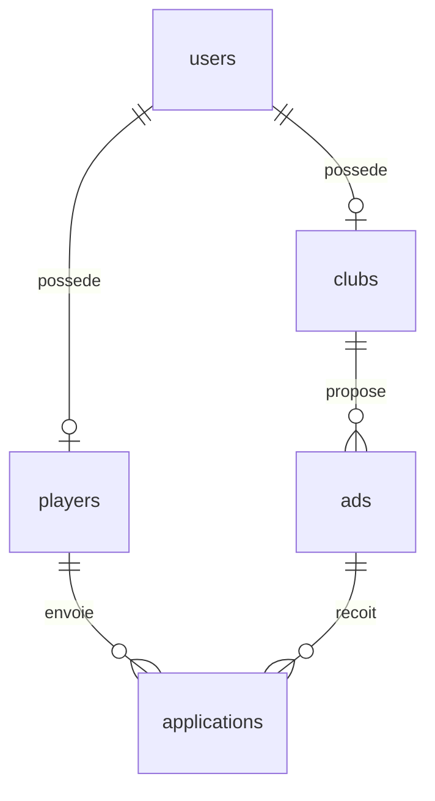

# PostgreSQL — partie de Joel

Ces fichiers concernent uniquement la base de donnees. Thomas garde le frontend,
Matteo garde Express, les sessions/JWT, bcrypt et les controles d'acces de l'API.

## Fichiers

| Fichier | Utilite |
|---|---|
| `schema.sql` | Creer les cinq tables, cles etrangeres, contraintes, index et regles SQL |
| `seed.sql` | Ajouter les comptes, clubs, joueurs et annonces de demonstration |
| `queries.sql` | Modeles de requetes parametrees a integrer dans le backend |
| `tests/run.py` | Creer une base temporaire et tester sans toucher a mercasport |
| `tests/workflow.sql` | Tester les validations et candidatures dans une transaction annulee |

## Comprendre les liens

| Table | Ce qu'elle represente | Exemple |
|---|---|---|
| `users` | Compte : nom affiche, email, hash bcrypt, role | Joel Lopes Ribeiro, role player |
| `players` | Profil sportif de base : prenom et nom | Joel / Lopes Ribeiro |
| `clubs` | Fiche du club et validation | FC Hegenheim, pending ou approved |
| `ads` | Offre de recrutement appartenant a un club | Gardien recherche |
| `applications` | Candidature dun joueur a une annonce | Joel postule avec un message |



`players.user_id` et `clubs.user_id` referencent `users.id`.
`applications.player_id` reference **players.id**, pas users.id.
Les numeros sont generes automatiquement et peuvent comporter des trous.
Il faut utiliser `RETURNING id`, jamais supposer qu'un compte ou un club porte le numero 1.
Les comptes de club affichent le nom de leur club dans `users.name`.

## Nouvelle base de demonstration

Depuis `/home/Joel/Mois1/MercaSport`, dans Ubuntu/WSL avec PostgreSQL installe :

```bash
sudo -u postgres createdb mercasport_demo
sudo -u postgres psql -X -v ON_ERROR_STOP=1 -d mercasport_demo < database/schema.sql
sudo -u postgres psql -X -v ON_ERROR_STOP=1 -d mercasport_demo < database/seed.sql
```

`createdb` se lance une seule fois. La redirection `<` permet a ton utilisateur
de lire les fichiers meme si postgres ne peut pas traverser ton dossier personnel.

Sur une base neuve, le seed contient : 17 comptes (13 clubs, 3 joueurs, 1 admin),
13 clubs, 3 profils joueurs, 4 annonces (2 approved, 1 pending, 1 rejected)
et 1 candidature de Joel. AS Thomas est le club pending de demonstration.

| Compte de demonstration | Email fictif |
|---|---|
| Joel Lopes Ribeiro | `joel.player@mercasport.example` |
| Thomas Lapin | `thomas.player@mercasport.example` |
| Matteo GrosBras | `matteo.player@mercasport.example` |
| Administrateur | `admin@mercasport.example` |
| FC Hegenheim | `hegenheim@mercasport.example` |

Mot de passe **public de test** des nouveaux comptes : `MercaSportDemo!2026`.
La base conserve seulement son hash bcrypt (cout 12). Ne pas utiliser ces comptes
sur un site public ; la connexion ne sera possible qu'apres implementation du backend.
Le seed ne remplace jamais le hash d'un compte deja present : les anciens comptes
avec `!COMPTE_DEMO_SANS_MOT_DE_PASSE!` restent sans mot de passe utilisable.

## Mettre a niveau la base actuelle sans perdre Thomas

Les fichiers du depot ne mettent pas automatiquement a jour PostgreSQL.
Les tests ont ete executes dans des bases temporaires, pas dans ta base locale.
Avant application, depuis la racine du projet :

```bash
backup_file="/tmp/mercasport-avant-schema-$(date +%Y%m%d-%H%M%S).dump"
sudo -u postgres pg_dump -Fc mercasport > "$backup_file"
# Continuer seulement si la sauvegarde a reussi.
sudo -u postgres psql -X -v ON_ERROR_STOP=1 -d mercasport < database/schema.sql
sudo -u postgres psql -X -v ON_ERROR_STOP=1 -d mercasport < database/seed.sql
```

Conserver le chemin affiche par `echo "$backup_file"` pour retrouver la sauvegarde.
Il n'y a aucun `DROP TABLE` dans le schema. Les comptes et clubs existants restent
en place avec leurs IDs. L'ajout de `clubs.status` place les anciens clubs en
`pending`, a faire valider par l'administrateur. Le seed preserve ces decisions :
il ne publie pas d'annonces de demonstration pour un club encore pending/rejected.

Le schema accepte la structure actuelle observee dans pgAdmin :
`users(id, name, email, password_hash, role, created_at)` et
`clubs(id, user_id, name, city, divisions)`.
Une ancienne table `users` avec seulement `email/password` provoque une erreur
explicite avant toute modification durable ; elle exige une migration dediee.
Un club sans compte ou un conflit de proprietaire doit etre corrige explicitement,
pas contourne en supprimant les tables. En cas d'erreur dans pgAdmin, faire `ROLLBACK;`.

Pour verifier les joueurs :

```sql
SELECT u.id AS user_id, u.name, u.role, p.first_name, p.last_name
FROM users u JOIN players p ON p.user_id = u.id ORDER BY u.id;
```

## Regles et responsabilites de Matteo

- L'inscription publique accepte seulement `player` ou `club`, jamais `admin`.
- Normaliser l'email (trim/minuscules), valider les longueurs et hasher avec bcrypt avant INSERT.
- Creer `users` et son profil dans une transaction avec le **meme client pg** ; annuler si le profil echoue.
- `clubs.status` et `ads.status` valent `pending` par defaut.
- Une annonce exige un club approved ; la table impose aussi cette regle avec un trigger.
- Lire `approved_ads` pour la liste ET le detail publics : elle filtre le statut de l'annonce et du club.
- La paire `(player_id, ad_id)` est unique ; les candidatures exigent une annonce et un club approved.
- Verifier le JWT/la session et le role dans Express. Les modeles SQL ne remplacent pas ces controles.
- Deriver le club et le joueur depuis le compte authentifie, jamais depuis un ID libre du navigateur.
- Ne renvoyer aucun hash au frontend. Une requete d'ecriture avec zero ligne RETURNING n'est pas un succes.
- Traduire les erreurs : `23505` conflit/doublon (409), `23503` lien inexistant,
  `23514` regle non respectee ; ajouter les reponses 401/403/404 adaptees dans l'API.
- Ajouter un club comme admin exige aussi son compte club ; reutiliser une transaction compte + fiche.
- Un retrait de validation masque les annonces mais conserve les anciennes candidatures.

`queries.sql` donne les requetes pour ces operations, avec `$1`, `$2`, etc.
Matteo les appelle avec `client.query(texteSQL, valeurs)` : ce fichier n'est pas un script a lancer en bloc.
Les routes, JWT, pages et formulaires ne sont pas implementes par cette livraison SQL.

## Connexion du backend

Sur le meme ordinateur : host `localhost`, port `5432`, database `mercasport`.
Le user/password depend du compte PostgreSQL choisi par Matteo ; les comptes de
la table users sont les comptes du SITE et ne remplacent pas ce compte PostgreSQL.
Sur son propre PC, Matteo doit installer sa base avec les fichiers du depot :
son `localhost` ne pointe pas vers le PC de Joel. Le `.env` doit rester hors Git.

## Tests

PostgreSQL serveur, `pg_config` et Python 3 doivent etre installes dans Ubuntu.
Depuis la racine, sans sudo :

```bash
python3 database/tests/run.py
```

Le test cree ses propres bases temporaires, accessibles seulement par socket local
dans un dossier prive, puis les arrete et les nettoie. Il ne se connecte pas a mercasport.
Il verifie creation, idempotence, contraintes, validation des clubs/annonces,
candidatures, requetes parametrees et preservation des anciens identifiants/hashes.
Il ne teste pas les endpoints HTTP, qui sont a realiser avec Matteo ensuite.

## Partage Git

Sur la branche `sql`, apres verification :

```bash
git status
git add database README.md
git commit -m "SQL Schema, validations et donnees de demonstration MercaSport"
git push -u origin sql
```

La fusion dans main se fait apres accord et tests avec les deux collegues.
Les modifications saisies plus tard dans pgAdmin ne se recopient pas toutes seules dans seed.sql.
